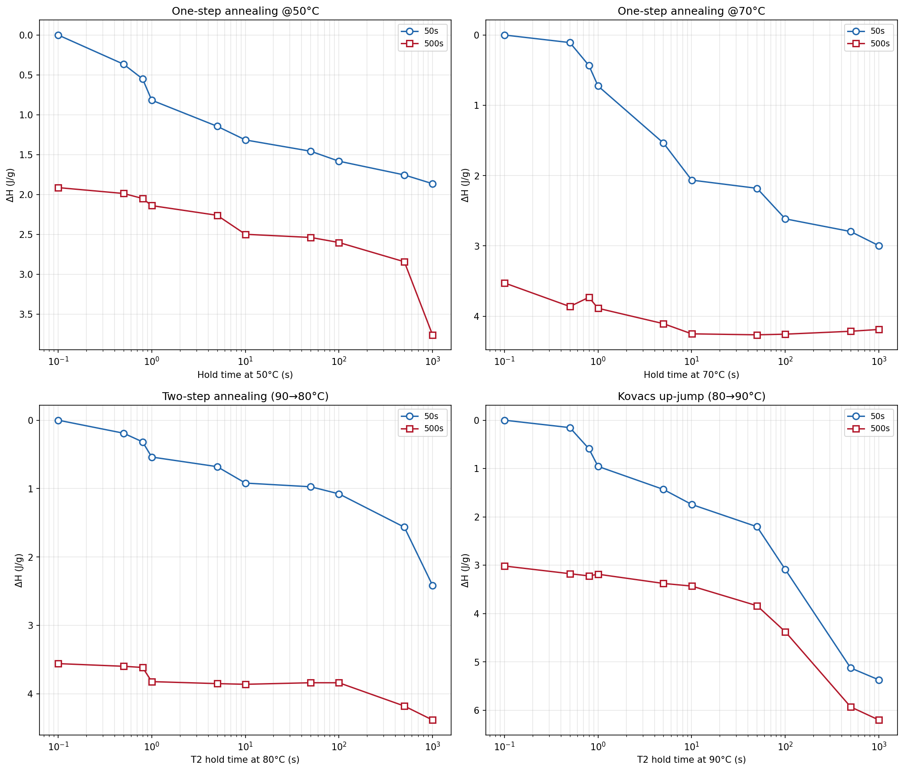
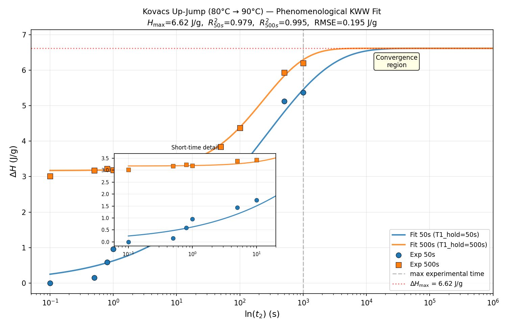
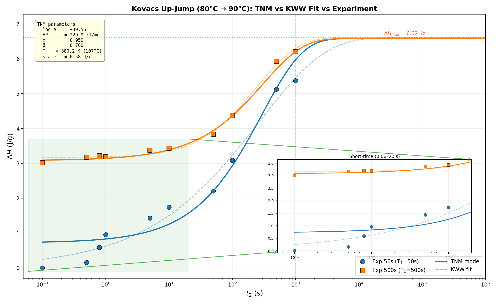
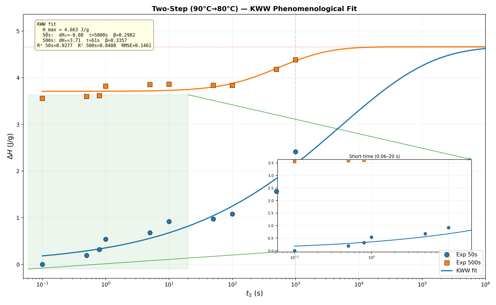
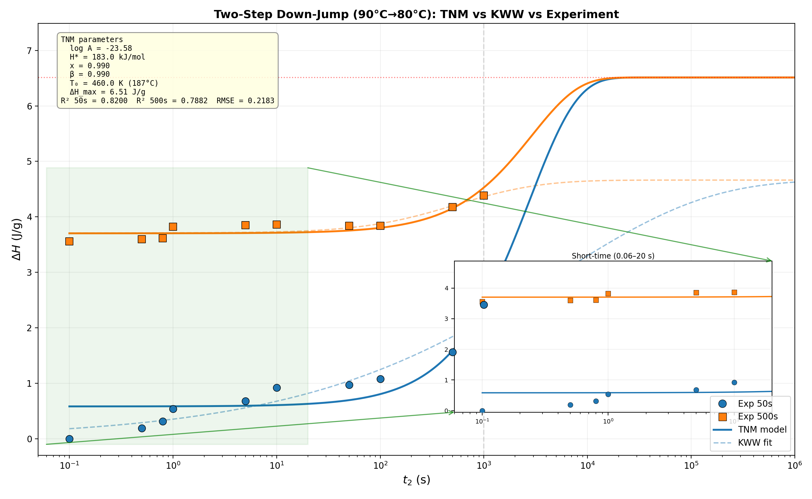

# **第一部分：重点工作复盘**

**重点目标：**完成TNM理论模型对四类退火实验（单步50°C、单步70°C、双步90→80°C降温、Kovacs 80→90°C升温记忆效应）的焓变数据拟合，建立从原始DSC→ΔH→KWW唯象拟合→TNM参数反求的完整自动化分析管线，评估拟合精度与误差来源。

**取得进展**：

1. **数据处理**：完成四类实验共80条DSC升温曲线的焓变提取，采用参考态（as-cooled无退火）减法 + T_onset自动检测，建立了统一的ΔH计算方法。

2. **Kovacs记忆效应实验（80→90°C）**：成功观察到典型非单调记忆效应。50s预退火组 ΔH = 0~5.37 J/g，500s预退火组 ΔH = 3.02~6.20 J/g，均呈先升后降特征，与文献报道一致。

3. **KWW唯象拟合**：Kovacs组 H_max = 6.62 J/g，β(50s/500s)均值约0.70，R²(50s) = 0.979，R²(500s) = 0.995，RMSE = 0.195 J/g。双步降温组趋势匹配但KWW参数出现物理不自洽（τ_50s > τ_500s），表明down-jump条件下唯象模型的局限性。

4. **TNM模型反求**：Kovacs组最优参数 log A = -30.55，H* = 229.9 kJ/mol，x = 0.95，β = 0.70，T0 = 380.2 K，其中x值与D'Amore (2006) PS文献值(x=0.9)吻合。TNM预测 vs 实验 R²(50s) = 0.946，R²(500s) = 0.992，RMSE vs KWW外推曲线 = 0.173 J/g。双步降温TNM直接拟合 R²(50s) = 0.820，R²(500s) = 0.788。

5. **自动化管线**：全流程脚本化（`export_enthalpy.py` → `kovacs_fit_phenom.py` → `kovacs_reverse_tnm.py` → `run_full_workflow.py`），一键生成3-way对比图（实验 + KWW + TNM）和数值对比表。

**关键结果图**：

*图1：四类实验ΔH-log(t)总览。Kovacs组（蓝/红）呈典型非单调记忆效应，其余三组（绿/橙/紫）为单调弛豫。*

*图2：Kovacs实验KWW唯象拟合。H_max = 6.62 J/g，R²(50s) = 0.979，R²(500s) = 0.995。*

*图3：Kovacs三向对比（实验 + KWW + TNM）。TNM预测 vs 实验 R²(50s) = 0.946，R²(500s) = 0.992。*

*图4：双步降温实验KWW唯象拟合。KWW参数出现τ_50s > τ_500s物理不自洽。*

*图5：双步降温三向对比。TNM直接拟合 vs 实验 R²(50s) = 0.820，R²(500s) = 0.788。*

**关键难点**：

1. **TNM多参数耦合优化**：四参数(log A, H*, x, β)强耦合，直接优化极易陷入局部最优。最终采用”KWW先验约束”策略——先对实验数据做KWW唯象拟合锁定β和H_max，再以多起点L-BFGS-B反求TNM参数，配合物理边界约束（x∈[0.1,0.95], β∈[0.1,0.7], T0∈[375,420]K），有效降低了优化难度。

2. **焓变定义修正**：初始错误地将退火态热流与空坩埚基线的差值作为弛豫信号。正确做法是退火态DSC直接减去参考态（as-cooled，同一热历史仅无退火）DSC——ΔDSC = DSC_annealed − DSC_ref，空坩埚基线在两者中均已自然扣除。修正后数据自洽性显著改善。

3. **实验数据波动**：退火后降至室温等待不足导致DSC升温初始段（50~70°C区间）热过冲，低焓变数据点波动大。单步退火和双步降温的拟合精度显著低于Kovacs组，根源正在于此。

**总结复盘**：

做得好的：（1）四类实验的Kovacs记忆效应信号清晰，TNM反求参数与文献一致，验证了整个数据处理管线的方法学正确性；（2）全流程自动化workflow建立，为后续高通量实验提供了可复用的基础设施。未达预期：单步退火和双步降温的拟合精度（R²≈0.78-0.82）明显低于Kovacs组（R²≈0.95-0.99），根本原因是DSC瞬态热效应导致低焓变区间数据噪声大于预期——此前低估了升温段热平衡时间对积分精度的影响。

**计划与风险**：

1. **优化实验方案**：退火完成后降温至低于室温（~10°C）并长时间等待→再升温测量，消除升温初始段热过冲对50°C~T_onset积分区间的干扰，预期可显著降低低焓变区数据波动。

2. **拓展退火参数矩阵**：参考Song et al. (2020) Au-MG体系的Kovacs效应判据（Δh > 0.4 kJ/mol才出现记忆效应），在PS体系中验证该S*阈值判据的适用性，确定高通量实验的双步退火温度-时间参数矩阵。

3. **风险**：PS与Au-MG的弛豫时间尺度差异可能导致记忆效应出现的Δh阈值不可比；DSC灵敏度可能不足以分辨小Δh区间（< 0.2 J/g）的记忆效应起始点，需评估是否需要提高样品量或改用Flash DSC。

# **第二部分：AI工具应用反思**

**具体案例**：在什么具体任务中使用了何工具？（限200字内）

1. **Claude Code + DeepSeek V4**：通过Claude Code的Agent/Skill框架调用DeepSeek V4，完成全部实验数据处理和TNM建模工作——包括原始DSC曲线基线扣除、ΔH积分提取、KWW唯象函数拟合（differential evolution + least_squares）、TNM多参数非线性优化（多起点L-BFGS-B），以及全流程对比图的自动生成。累计产出8个Python脚本（~2000行代码）和4个可复用Skill文件。

2. **Zotero + Agent**：尝试部署Zotero文献管理Agent，用于自动更新玻璃物理领域的文献知识库和引用框架。

**价值与成本**：它解决了什么过去难以解决的问题？自己的时间精力投入与产生的效果怎样？（限200字内）

核心价值在于将一次性的数据分析工作转化为可持久复用的自动化管线。4个Skill文件（`kovacs-workflow`、`twosteps-workflow`、`auto-commit`、`auto-execute`）记录了完整的参数配置、分析逻辑和输出规范，后续新增实验仅需替换输入文件即可一键复现全流程。编码时间约2天，但若纯手工处理四类实验共80条DSC曲线并完成TNM多参数优化，保守估计需要1-2周，且难以保证分析的一致性。当前管线已具备批量化、标准化数据处理能力。

**可复用模式/教训**：总结值得其他团队成员借鉴的AI工具使用方法或失败教训。（限200字内）

**成功经验**：（1）Claude Code的Skill机制是"好马配好鞍"的关键——DeepSeek V4本身缺乏结构化的任务编排能力，但嵌入Claude Code的Skill框架后，多步推理的连贯性和输出规范性显著提升。（2）对复杂数值优化任务（如TNM反求），采用"粗搜索+精修"两步策略（先differential evolution全局定位，再L-BFGS-B局部精修），比单次AI生成代码的成功率高得多。（3）将分析逻辑沉淀为Skill而非一次性脚本，极大降低了后续复用成本。

**失败教训**：Zotero Agent部署频繁中断且调试困难，根本原因是Zotero API的认证机制和速率限制与Agent的自动轮询模式不兼容。启示：在工具链选型时，应优先评估目标工具的API成熟度和自动化友好性，避免在缺乏稳定接口的工具上投入过多集成成本。

# **第三部分：介绍一篇论文**

**研究意义**：论文针对什么问题？为什么这个问题重要？为什么在每周读得这么多论文中选择这篇论文？（限300字内）

论文聚焦玻璃科学中三个长期未解的核心问题：（1）过冷液体是否存在发散的特征长度尺度？（2）是否存在有限温度下构型熵为零的"理想玻璃"态？（3）深过冷液体中分子运动是否存在普适的线性响应函数？玻璃是日常生活中无处不在的材料，但玻璃化转变的本质仍是凝聚态物理最深层的谜题之一——它不同于已透彻理解的晶体相变，缺乏统一的微观理论框架。选择这篇论文，是因为它以罕见的"物理学家 vs 化学家"双重视角展开对话，在短短一篇文章中同时审视三个前沿问题的十年进展：物理学家追求普适性，化学家强调多样性，而本文的立场是——两者皆为"深刻的真理"。这种全景式的学科交叉视野，比单一问题的研究论文更能启发整体思考。

**学术贡献**：论文核心创新点是什么？针对拟解决的问题，论文中采用何种方法、取得何种成果？（限300字内）

核心创新在于将物理学（普适性）与化学（特异性）的范式对立系统性地应用于三大玻璃科学问题，揭示了两者互补而非对立的本质。方法上，论文综述了过去10-15年的关键实验与模拟进展：在长度尺度问题上，总结了界面效应可达~200 nm的长程扰动，挑战了传统5-8个分子直径的短程关联图像；在理想玻璃问题上，讨论了气相沉积超稳定玻璃作为逼近理想玻璃态的实验实现，以及Kauzmann温度处构型熵外推至零的热力学困境；在普适弛豫问题上，综合动态光散射和介电谱数据，揭示高频ω^{-1/2}幂律可能是分子自关联的普适特征，而交叉关联导致偏离。结论：玻璃科学中既有跨越体系的普适规律，也有由化学键、分子形状决定的系统特异性，二者不可偏废。

**联系与启发**：这个工作对我们的启发是什么？具体对应着我们当前项目中的哪个假设或目标？（限300字内）

这篇论文最核心的启示是：普适性与特异性并非对立，而是研究复杂非晶体系的两个必要维度。对应到当前项目，如果我们研究的是非晶或玻璃态材料的设计与性能，可借鉴以下思路：（1）寻找跨体系的普适标度律（如弛豫频谱的通用形状），作为理论建模的"零阶近似"；（2）在此基础上用化学特异性（键合类型、分子几何、氢键网络）解释偏差并实现性能调控；（3）重视界面长程效应——实验表明界面可扰动200 nm以上的动力学，这对薄膜、纳米复合材料的假设有直接冲击；（4）超稳定玻璃（气相沉积制备）可视为逼近"理想玻璃"的模型体系，若项目涉及玻璃态稳定性的假设，该体系是理想的实验验证平台。如果项目有"弛豫动力学可忽略体系差异"或"界面效应仅限纳米尺度"的隐含假设，本文提供了挑战和修正的实证依据。